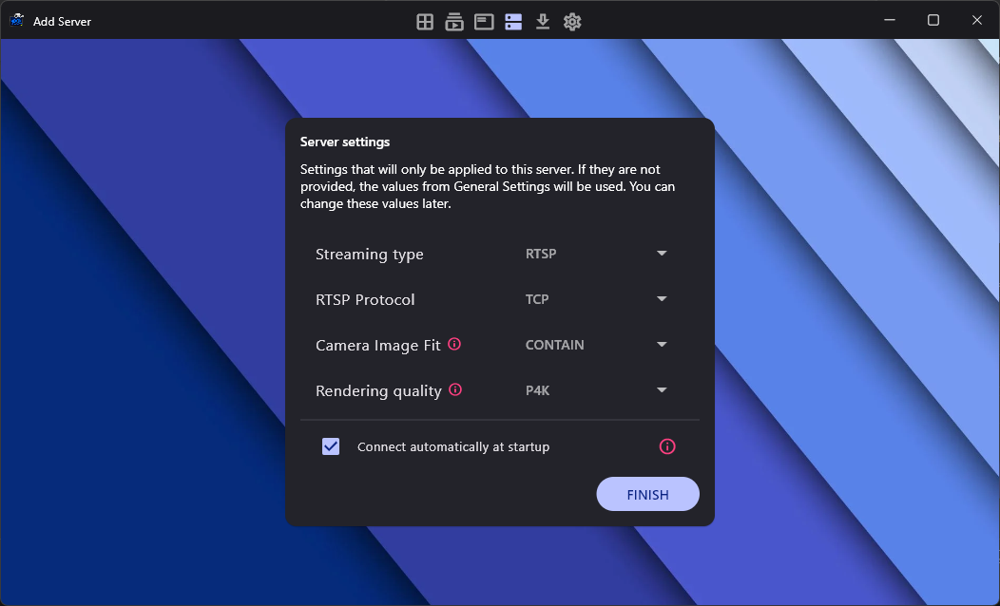
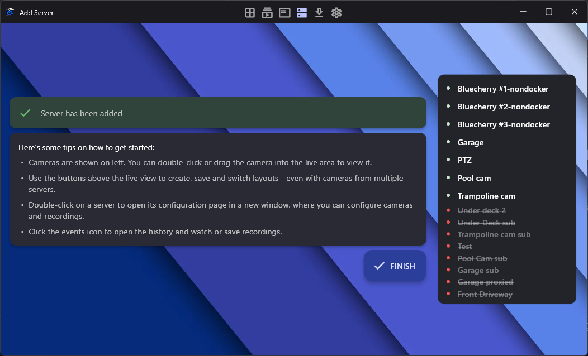

# Usage

## Overview

The Bluecherry Client lets you watch live and recorded video from your Bluecherry server. It is a cross-platform application that runs on Android, iOS, Windows, macOS, and Linux.

## Download, Installation

Refer to [README.md](./README.md#download) for installation instructions.

## Requirements

You will need a Bluecherry server to use this application. You can buy a license from the [Bluecherry website](https://www.bluecherrydvr.com/).

## Connecting to the server

These steps will guide you through easily connecting to your Bluecherry server. You can add as much servers as necessary. The steps are similar for all platforms.

`1.` Enter the hostname or IP address of the Bluecherry server. The default login and password for new installations is `Admin` and `bluecherry`. You can optionally click `Use default` to have this information automatically entered for you.

Click `Next` to connect.

`2.` You can optionally change some settings for the server, such as the streaming type, RTSP protocol, and rendering quality.

You can optionally leave these as they are. Click `Finish` to add the server.

`3.` If the server was successfully added, you will be able to see the server in the server list and view the cameras.

Click `Finish` to close the process.